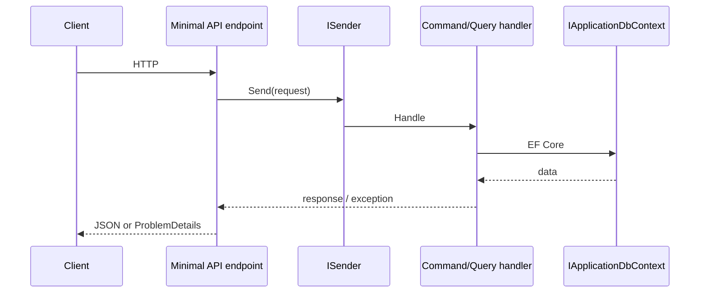
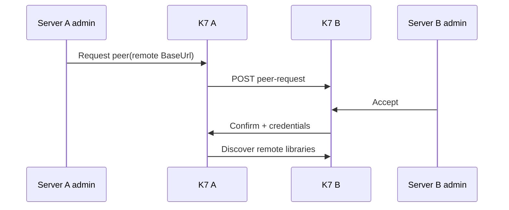

# Architecture

K7 follows Clean Architecture with a strict dependency direction:

```text
Domain -> Application -> Infrastructure -> Web (host)
                              ^
Shared (DTOs) ----------------+
Clients (Blazor) consume Shared + HTTP/SignalR from Web
```

Setup, style, and PRs: [CONTRIBUTING.md](../../CONTRIBUTING.md). Day-to-day: [developing.md](developing.md). UI constraints: [design.md](design.md). Releases: [releasing.md](releasing.md). Agents: [AGENTS.md](../../AGENTS.md).

## Layer responsibilities

| Project | Namespace | Role | May reference |
|---|---|---|---|
| `Server/Domain` | `K7.Server.Domain` | Entities, value objects, enums, events, interfaces | Nothing |
| `Server/Application` | `K7.Server.Application` | CQRS use cases (MediatR), validators, mappings | Domain |
| `Server/Infrastructure/*` | `K7.Server.Infrastructure.*` | EF Core, filesystem, ffmpeg, external HTTP | Domain, Application |
| `Server/Web` | `K7.Server.Web` | ASP.NET Core host, Minimal APIs, SignalR, setup UI | All server layers |
| `Shared/K7.Shared` | `K7.Shared` | DTOs and constants shared with clients | Domain enums + `nameof` only |
| `Clients/Shared` | `K7.Clients.Shared` | Client services, models, interfaces | K7.Shared |
| `Clients/Shared/UI` | `K7.Clients.Shared.UI` | Blazor pages, layouts, K7 component library | Clients.Shared |
| `Clients/Web` / `Clients/MAUI` | ... | WASM and MAUI hosts | Clients.Shared + Shared.UI |
| `Clients/DesignSystem` | `K7.Clients.DesignSystem` | Component catalog (Blazor Server showcase) | Shared.UI |

## Request flow



Pipeline behaviors (order): Validation -> Authorization -> UnhandledException -> Performance.

Exceptions map via `CustomExceptionHandler` (`ValidationException` 400, `ForbiddenAccessException` 403, `NotFoundException` 404). Handlers throw typed exceptions; no `Result<T>` wrapper.

CQRS layout: `Features/{Feature}/Commands|Queries/{Name}/{Name}.cs` (request + handler same file), validators alongside, domain event handlers under `EventHandlers/`. DTO mapping via extension methods in `Application/Common/Mappings/` (no AutoMapper). Endpoints in `Server/Web/Endpoints/` stay thin and delegate to `ISender`.

## Infrastructure split

Under `src/Server/Infrastructure/`:

| Project | Responsibility |
|---|---|
| `Configuration` | Options types (`Database`, `Authentication`, `Security`, `Paths`) |
| `Database/Context` | EF Core, Identity, OpenIddict, interceptors, DI entry |
| `Database/Providers/Postgres` | Postgres migrations assembly |
| `Database/Providers/Sqlite` | Sqlite migrations assembly |
| `ExternalServices` | Outbound integrations (including federation HTTP client) |
| `FileSystem` | Ensure config/metadata/log/transcode directories exist |
| `MediaProcessing` | ffmpeg, metadata providers (TMDb, TVDB, MusicBrainz, ...) |

Migrations: always add for **both** providers - commands in [CONTRIBUTING.md](../../CONTRIBUTING.md#migrations).

## SignalR and transcoding

The Web host exposes a SignalR hub for remote control, Sync Play, and live UI updates. Proxies must allow WebSockets.

Playback: client requests a stream decision -> remux vs transcode -> encoder selection (software or hardware) -> temp files under `Paths:Transcoding`. Details: [Operating - Transcoding](../admin/operating.md#transcoding).

## Federation (high level)



Operator guide: [Operating - Federation](../admin/operating.md#federation).

## Domain events

Entities inherit `BaseEntity` and raise `BaseEvent` via `AddDomainEvent()`. EF Core interceptors dispatch events after save.

## UI layout

| Area | Path |
|---|---|
| Pages | `src/Clients/Shared/UI/Pages/` |
| Layouts | `src/Clients/Shared/UI/Layout/` |
| K7 components | `src/Clients/Shared/UI/Components/` |
| Client services | `src/Clients/Shared/Services/` |
| Tokens / themes | `src/Clients/Shared/UI/wwwroot/` |
| DesignSystem catalog | `src/Clients/DesignSystem/` |

**Triad:** `.razor` + `.razor.cs` + optional `.razor.css`. Put logic in `.razor.cs`; keep `@code` only for tiny leaves (about 15 lines or fewer of parameters/no methods). Never leave both a non-trivial `@code` block and a `.razor.cs` on the same component. No third-party UI frameworks in pages. Theming and visual rules: [design.md](design.md). Localization and DesignSystem workflow: [developing.md](developing.md).
