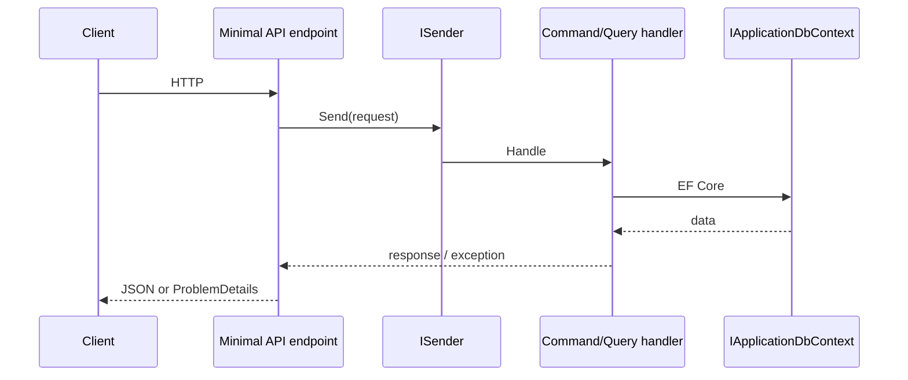
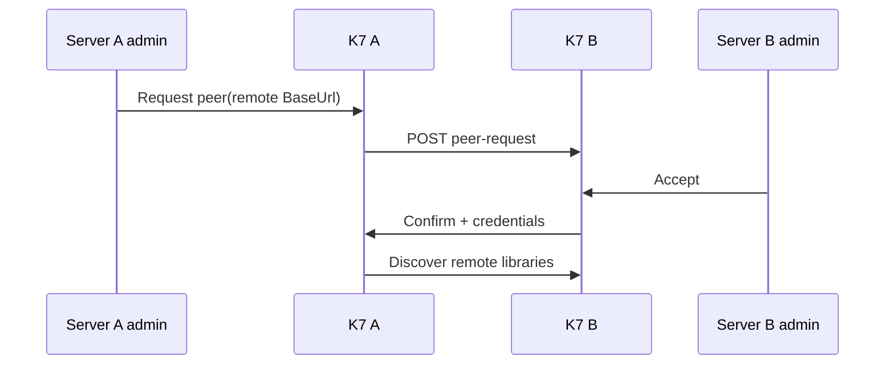

# Architecture

K7 follows Clean Architecture with a strict dependency direction:

```text
Domain -> Application -> Infrastructure -> Web (host)
                              ^
Shared (DTOs) ----------------+
Clients (Blazor) consume Shared + HTTP/SignalR from Web
```

Setup, style, and PRs: [CONTRIBUTING.md](../../CONTRIBUTING.md). Day-to-day: [developing.md](developing.md). UI constraints: [design.md](design.md). Releases: [releasing.md](releasing.md). Agents: [AGENTS.md](../../AGENTS.md).

## Layer responsibilities

| Project | Namespace | Role | May reference |
|---|---|---|---|
| `Server/Domain` | `K7.Server.Domain` | Entities, value objects, enums, events, interfaces | Nothing |
| `Server/Application` | `K7.Server.Application` | CQRS use cases (MediatR), validators, mappings | Domain |
| `Server/Infrastructure/*` | `K7.Server.Infrastructure.*` | EF Core, filesystem, ffmpeg, external HTTP | Domain, Application |
| `Server/Web` | `K7.Server.Web` | ASP.NET Core host, Minimal APIs, SignalR, setup UI | All server layers |
| `Shared/K7.Shared` | `K7.Shared` | DTOs and constants shared with clients | Domain enums + `nameof` only |
| `Clients/Shared` | `K7.Clients.Shared` | Client services, models, interfaces | K7.Shared |
| `Clients/Shared/UI` | `K7.Clients.Shared.UI` | Blazor pages, layouts, K7 component library | Clients.Shared |
| `Clients/Web` / `Clients/MAUI` | ... | WASM and MAUI hosts | Clients.Shared + Shared.UI |
| `Clients/DesignSystem` | `K7.Clients.DesignSystem` | Component catalog (Blazor Server showcase) | Shared.UI |

## Request flow


```mermaid
sequenceDiagram
    participant Client
    participant Endpoint as Minimal API endpoint
    participant MediatR as ISender
    participant Handler as Command/Query handler
    participant Db as IApplicationDbContext

    Client->>Endpoint: HTTP
    Endpoint->>MediatR: Send(request)
    MediatR->>Handler: Handle
    Handler->>Db: EF Core
    Db-->>Handler: data
    Handler-->>Endpoint: response / exception
    Endpoint-->>Client: JSON or ProblemDetails
```

Pipeline behaviors (order): Validation -> Authorization -> UnhandledException -> Performance.

Exceptions map via `CustomExceptionHandler` (`ValidationException` 400, `ForbiddenAccessException` 403, `NotFoundException` 404). Handlers throw typed exceptions; no `Result<T>` wrapper.

CQRS layout: `Features/{Feature}/Commands|Queries/{Name}/{Name}.cs` (request + handler same file), validators alongside, domain event handlers under `EventHandlers/`. DTO mapping via extension methods in `Application/Common/Mappings/` (no AutoMapper). Endpoints in `Server/Web/Endpoints/` stay thin and delegate to `ISender`.

## OpenSubsonic compatibility layer

K7 exposes an OpenSubsonic-compatible facade under `/rest`, alongside the native `/api` used by first-party clients. Outbound Music intelligence calls go to AudioMuse's own HTTP API. When AudioMuse is configured as the mediaserver for K7, it reaches K7 through `/rest` with an OpenSubsonic `apiKey`.

| Concern | Behavior |
|---|---|
| IDs | Same Guid strings as `/api/medias/{id}` (no prefix) |
| Auth | `apiKey` query (extension `apiKeyAuthentication`) for admin/automation, or username + **app password** via `u`+`p` or Subsonic `t`+`s` (not the account password). API keys are not assigned to another user. Client name (`c`) registers an **External** device for admin devices, active streams, and history. |
| Implementation | `Application/Features/OpenSubsonic` + `Web/OpenSubsonic` |
| Streaming | Direct file when possible. Progressive ffmpeg transcode when `format` / `maxBitRate` requires it (`timeOffset` via `transcodeOffset`). History is written on `scrobble` / `reportPlayback`, not on `stream` alone. `reportPlayback` stopped uses the real position. Completion follows the effective K7 audio playback policy. Classic `scrobble(submission=true)` remains client-driven (full end). When a client starts another track without ending the previous one, K7 ends only the latest open session on that device at its known progress (no wall-clock backfill of older abandoned plays). Finished listens under 30s watched are flagged `IsSkipped` in playback history and increment `UserMediaState.SkipCount` (music player and Most skipped in watch stats). |
| Extensions | `apiKeyAuthentication`, `songLyrics`, `formPost`, `playbackReport`, `transcodeOffset` |
| Starred | Mapped to `UserRating` with value `> 5` (same store as star ratings in the K7 UI) |
| Play queue | Not implemented yet (`getPlayQueue` / `savePlayQueue` return not found). Planned alongside native K7 play-queue work. |
| Admin progress | External clients hide the active-stream progress bar until `reportPlayback` provides a timeline (`HasPlaybackProgress`). |

Out of scope for the facade: video, podcasts, internet radio, public shares, chat, jukebox, user admin via Subsonic, bookmarks, sonic-path OS extensions. Backlog: richer OS `transcoding` endpoints (`getTranscodeDecision` / `getTranscodeStream`).

## Infrastructure split

Under `src/Server/Infrastructure/`:

| Project | Responsibility |
|---|---|
| `Configuration` | Options types (`Database`, `Authentication`, `Security`, `Paths`) |
| `Database/Context` | EF Core, Identity, OpenIddict, interceptors, DI entry |
| `Database/Providers/Postgres` | Postgres migrations assembly |
| `Database/Providers/Sqlite` | Sqlite migrations assembly |
| `ExternalServices` | Outbound integrations (including federation HTTP client) |
| `FileSystem` | Ensure config/metadata/log/transcode directories exist |
| `MediaProcessing` | ffmpeg, metadata providers (TMDb, TVDB, MusicBrainz, ...) |

Migrations: always add for **both** providers - commands in [CONTRIBUTING.md](../../CONTRIBUTING.md#migrations).

## SignalR and transcoding

The Web host exposes a SignalR hub for remote control, Sync Play, and live UI updates (playback progress, user ratings, library changes). Proxies must allow WebSockets.

User ratings: `RateMedia` (and review upsert) broadcast `ReceiveUserRatingUpdated` to the acting user's hub group. Clients keep a session overlay (`IUserRatingSync`) so playlist/album/player `RatingStars` instances update immediately, including the originating session before the hub echo arrives.

Playback: client requests a stream decision -> remux vs transcode -> encoder selection (software or hardware) -> temp files under `Paths:Transcoding`. Details: [Operating - Transcoding](../admin/operating.md#transcoding).

## Federation (high level)


```mermaid
sequenceDiagram
    participant A as Server A admin
    participant SA as K7 A
    participant SB as K7 B
    participant B as Server B admin

    A->>SA: Request peer(remote BaseUrl)
    SA->>SB: POST peer-request
    B->>SB: Accept
    SB->>SA: Confirm + credentials
    SA->>SB: Discover remote libraries
```

Operator guide: [Operating - Federation](../admin/operating.md#federation).

## Domain events

Entities inherit `BaseEntity` and raise `BaseEvent` via `AddDomainEvent()`. EF Core interceptors dispatch events after save. Non-EF paths (e.g. transcode failures, AudioMuse health) use `IDomainEventPublisher`.

## Shared profiles

`SharedProfile` is a membership hat over real `User` accounts (not a fake user). When active (client sends `X-Shared-Profile-Id`, validated server-side against membership), continue watching uses profile-scoped `SharedProfileMediaStates`, and history/stats queries for that session are scoped to sessions tagged with the profile. Personal `UserMediaState` is not written for shared mid-progress (so personal continue watching stays clean) - any member (host or co-viewer) can resolve and drive a shared session. `MediaPlaybackSession` rows still record the acting `UserId` with `SharedProfileId` set and list the other members as co-viewers; personal history and watch stats include those sessions for every member. When a shared session newly completes, each member's personal `UserMediaState` is marked watched for that media (completed only - no personal CW pollution). When a shared profile is deleted (including leave that removes the last viable membership), shared media states are merged into each member's personal `UserMediaState` before cascade delete. Playback policy settings (`SharedProfileSettings`), the optional content restriction profile (`SharedProfile.ContentRestrictionProfileId`), and shared playlists (`SharedProfilePlaylists`) are owned by the profile itself, not the host personally: `MediaAccessGuard` and the playback policy provider prefer the active shared profile's own settings over the acting member's personal ones, and a shared profile with no restriction profile assigned means unrestricted for that session (no fallback to a member's personal profile). Person `GetPersonKnownFor` follows the same resolution and returns no external posters when a restriction profile is in effect, because those TMDB images are not in the library and cannot be evaluated against restriction rules. An optional profile avatar is stored as `MetadataPicture` (`SharedProfileAvatar`) linked via `SharedProfileId`; when set, clients show a single `K7Avatar` instead of the stacked member `K7AvatarGroup`. Native clients keep a device-wide shared-profile cache merged by id across sign-ins, so a profile pinned with **Show on this device** stays on the profile selection screen even after a local user who is not a member signs in.

## UI layout

| Area | Path |
|---|---|
| Pages | `src/Clients/Shared/UI/Pages/` |
| Layouts | `src/Clients/Shared/UI/Layout/` |
| K7 components | `src/Clients/Shared/UI/Components/` |
| Client services | `src/Clients/Shared/Services/` |
| Tokens / themes | `src/Clients/Shared/UI/wwwroot/` |
| DesignSystem catalog | `src/Clients/DesignSystem/` |

**Triad:** `.razor` + `.razor.cs` + optional `.razor.css`. Put logic in `.razor.cs`; keep `@code` only for tiny leaves (about 15 lines or fewer of parameters/no methods). Never leave both a non-trivial `@code` block and a `.razor.cs` on the same component. No third-party UI frameworks in pages. Theming and visual rules: [design.md](design.md). Localization and DesignSystem workflow: [developing.md](developing.md).

Native clients keep Home mounted across navigation (`FeedHub`). `HomeFeedStore` is a process singleton scoped by identity user id plus the optional active shared profile id. Switching a local user (or shared profile) on MAUI reloads the home rows and continue-watching cache instead of reusing the previous feed. The SignalR hub reconnects so playback-progress events follow the new identity.

MAUI `BlazorWebView.StartPath` opens `/select-profile` (or `/welcome` when no local users, `/linkdevice` on TV when Guest is disabled, or `/` for solo auto-login) so `MainLayout` / FeedHub do not run around `RedirectToLogin`.

## Video playback (MAUI)

During video play on Android/iOS, MAUI uses a **native XAML overlay** on top of `MediaElement` (TextureView). Windows MAUI keeps Video.js + Blazor controls in WebView2. Browse UI stays Blazor Hybrid. Details and the Windows `#EXT-X-MAP` limitation: [video-playback.md](video-playback.md).

## Music playback (MAUI Android)

Android music uses two Media3 ExoPlayers in `K7MediaLibraryService` (session player + idle player) so crossfade and gapless can overlap. After the blend, the incoming player is promoted in place (`ForwardingSimpleBasePlayer.setPlayer`); the next track is not reloaded onto the freed session player. Windows music stays on WebView2 / Web Audio. iOS uses dual `AVPlayer`.

## Offline downloads (MAUI)

Offline transfers run in-process via `DownloadManager` (`HttpClient` streaming). The queue is in-memory: force-stop or process death still loses in-progress transfers (completed files persist in SQLite + `AppData/downloads`).

Offline playback progress and ratings are queued in `PendingPlaybackEvents` with `IdentityUserId`. `PlaybackSyncService` flushes them only after first Blazor paint (past select-profile / splash) for the currently **online** authenticated user. Rows without a user id are dropped and never sent.

On Android, a `dataSync` foreground service (`DownloadForegroundService`) with an ongoing notification keeps the process alive while **user** downloads are queued, preparing, or transferring. Music-cache lookahead does not start that service (playback already has a media foreground service). Other MAUI platforms have no equivalent keep-alive yet.
